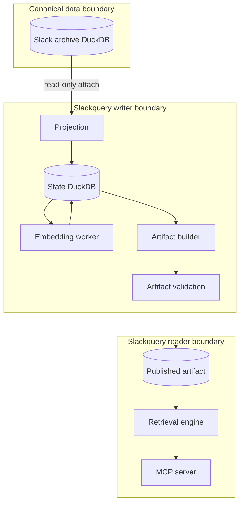

# Architecture and design plan

## Purpose

Slackquery provides local-first hybrid retrieval over a canonical Slack archive.
It treats the source database as immutable input, owns a separate enrichment
state database, publishes immutable DuckDB search artifacts, and exposes a
read-only MCP interface.

This document describes design invariants, implemented components, and future
work. It deliberately excludes deployment-specific inventory and operational
observations.

## Design goals

1. Preserve canonical ownership: Slackquery never mutates the ingestion database.
2. Produce deterministic, explainable search documents and vector generations.
3. Resume safely after interruption without repeating completed embedding work.
4. Keep write-heavy enrichment isolated from latency-sensitive readers.
5. Publish only validated artifacts and retain a simple rollback path.
6. Support lexical, semantic, and fused retrieval through a portable MCP API.
7. Run entirely on infrastructure selected by the operator.

## Non-goals

- ingesting data from Slack APIs;
- modifying or repairing the canonical archive;
- replacing a general analytics interface to the source database;
- making an experimental approximate-nearest-neighbor extension mandatory;
- exposing arbitrary SQL through MCP.

## System boundaries



The writer requires access to canonical input, durable state, artifact storage,
and an embedding endpoint. The reader requires only the selected artifact and,
for semantic queries, an embedding endpoint compatible with the artifact's
generation metadata.

## Data model

### Search documents

The projection creates one primary search document per active message, one
bounded context document per thread, and deterministic chunks for safely
extractable attachments. Documents contain stable source identity,
workspace/channel/author metadata, timestamps, thread relationships, resolved
text, source revision, and a versioned embedding recipe.

Projection requirements:

- deterministic output for unchanged canonical rows;
- deletion/tombstone propagation;
- no mutation of canonical tables;
- versioned text recipes when normalization changes;
- stable identifiers across rebuilds.

### Embedding generations

A generation identity includes:

- model name and optional operator-provided model revision;
- document and query prefixes;
- native and stored dimensions;
- truncation and normalization rules;
- text recipe version.

The current recipe stores the first 512 dimensions and then applies L2
normalization. Transport selection is excluded from generation identity so a
compatible PyTorch server and Ollama can share vectors. Model revision pinning is
recommended but configured only through the environment; public source does not
assume a digest.

### Immutable artifact

Each artifact contains:

- projected active documents;
- one validated vector per message and file chunk for the selected generation;
- thread-context documents used as contextual candidates without duplicate vectors;
- DuckDB FTS indexes;
- build metadata, source watermark, schema version, and checksums.

Artifacts are complete snapshots. Publication atomically changes a selector to a
validated candidate. Existing readers continue using the previous file until
they reopen, avoiding mixed-version reads.

## Pipeline

1. **Project** canonical messages into durable state.
2. **Claim** missing or stale embedding work with expiring leases.
3. **Embed** bounded batches and validate dimensions, finite values, and norms.
4. **Checkpoint** each outcome, retrying only classified transient failures.
5. **Build** a candidate from active documents with successful vectors.
6. **Validate** schema, row counts, generation consistency, FTS behavior,
   checksums, and a fresh read-only open.
7. **Publish** by atomically updating the current-artifact selector.
8. **Retain** multiple known-good artifacts for rollback.

Dagster assets encode these dependencies and checks, but the CLI keeps each stage
independently operable.

## Retrieval design

### Lexical retrieval

DuckDB FTS supplies BM25 candidates for identifiers, filenames, URLs, quoted
phrases, error text, and domain terminology. Input is tokenized before reaching
FTS syntax, and metadata filters remain parameterized.

### Semantic retrieval

The query receives the configured query prefix, is embedded by the active local
backend, truncated and normalized identically to documents, and compared with an
exact cosine scan. Exact scan is the default because it is simple and predictable
for moderate archives.

### Hybrid retrieval

Lexical and semantic branches produce independent ranks. Reciprocal rank fusion
combines them without attempting to calibrate incomparable raw scores:

```text
RRF(document) = Σ 1 / (k + branch_rank(document))
```

Filters apply consistently to both branches. Stable tie-breaking and an opaque,
artifact-bound cursor make pagination deterministic.

## API and security model

The Streamable HTTP MCP server exposes only bounded, read-only tools:

- `search_slack`
- `get_slack_message`
- `get_slack_thread`
- `list_slack_scopes`

Controls include query/result/filter caps, parameterized SQL, sanitized FTS
queries, optional bearer authentication, stateless HTTP operation, and separate
liveness/readiness probes. Operators should terminate TLS and enforce network
policy in a reverse proxy or service mesh for remote deployments.

## Reliability invariants

- Canonical input is always attached read-only.
- A content hash and generation identify reusable vectors.
- Claims have leases; failed workers do not permanently strand work.
- Validation precedes publication.
- The reader never opens mutable pipeline state for search.
- A cursor cannot be reused with another artifact, query, mode, or filter set.
- Backend switches do not imply vector compatibility; generation metadata does.

## Performance strategy

Current retrieval uses DuckDB FTS and exact vector scans. Optimize in this order:

1. preserve a representative benchmark and relevance set;
2. tune candidate windows, projection width, and query execution;
3. separate query embedding latency from database latency;
4. evaluate approximate indexing only when exact scan misses the latency target;
5. require persisted-index correctness, rebuild, and rollback tests before use.

Measured reference results are documented in [docs/benchmarks.md](docs/benchmarks.md).

## Delivery roadmap

### Implemented automated Gold scope

- deterministic message, thread-context, and attachment-chunk projection;
- attachment traversal and symlink-escape rejection;
- resumable content-addressed embedding worker;
- PyTorch-compatible and Ollama transport switch;
- immutable artifact build, checksum validation, publication, retention, and rollback;
- lexical, semantic, and route-aware hybrid retrieval with weighted RRF;
- MCP server, bearer authentication, health probes, CLI, and Dagster assets;
- Prometheus metrics, state backup/restore, and blocking Gold checks;
- unit, integration, security, and deployment-contract tests.

### Near term

- publish a small synthetic fixture and end-to-end tutorial;
- add human-judged relevance evaluation and regression thresholds if relevance
  claims become necessary;
- test reverse-proxy and authentication recipes in CI.

### Later

- approximate vector indexes for archives where exact scan is insufficient;
- multi-generation migration tooling and artifact promotion workflows.

## Acceptance criteria

- Re-running projection without source changes produces no semantic changes.
- Interrupted embedding resumes without recomputing successful vectors.
- Invalid vectors and model mismatches cannot enter a published artifact.
- Failed candidate validation leaves the current artifact unchanged.
- All MCP operations are bounded and read-only.
- Lexical, semantic, and hybrid modes honor identical filters.
- Tests, Ruff, and strict mypy pass before release.
