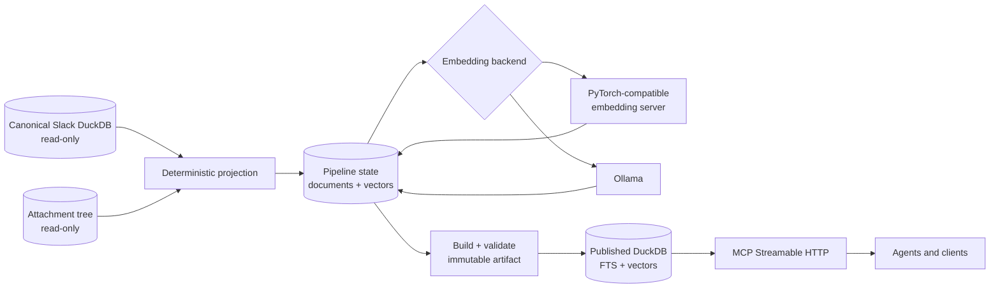

<div align="center">

# Slackquery

### Private-by-design hybrid search for Slack archives

[](https://www.python.org/)
[](https://duckdb.org/)
[](https://dagster.io/)
[](https://modelcontextprotocol.io/)
[](compose.yaml)
[](tests/)
[](LICENSE)

[Documentation](https://github.com/thomasmaerz/slackquery/wiki) ·
[Sister project: Slackpipe](https://github.com/thomasmaerz/slackpipe) ·
[Slackpipe wiki](https://github.com/thomasmaerz/slackpipe/wiki)

<a href="https://www.python.org/"></a>
&nbsp;
<a href="https://www.docker.com/"></a>
&nbsp;
<a href="https://www.kernel.org/"></a>
&nbsp;
<a href="https://duckdb.org/"></a>
&nbsp;
<a href="https://dagster.io/"></a>

</div>

Slackquery turns a canonical Slack archive in DuckDB into an immutable search
artifact and serves it through Model Context Protocol (MCP). It combines BM25
lexical retrieval with exact cosine similarity and reciprocal rank fusion (RRF),
while keeping ingestion data read-only and deployment under your control.

## Why Slackquery

- **Hybrid retrieval:** exact terms through DuckDB FTS, semantic matches through
  local embeddings, query-aware routing, weighted RRF, exact-term boosts, and
  deterministic thread/channel diversity.
- **Context-rich documents:** messages, bounded thread contexts, and safely
  extracted text, code, CSV, PDF, DOCX, and PPTX attachment chunks.
- **Immutable serving:** build and validate a new artifact before atomically
  publishing it; readers never share the mutable pipeline database.
- **Local model support:** switch between a batched PyTorch-compatible server and
  Ollama with one environment variable.
- **Resumable enrichment:** content-addressed vectors, leases, retries, and
  durable checkpoints make embedding work incremental and idempotent.
- **Read-only MCP tools:** bounded search, exact message lookup, thread expansion,
  scope discovery, health probes, and optional bearer authentication.
- **Dagster-native operations:** assets, checks, and event-driven reconciliation
  sensors are included without coupling the MCP process to the writer.
- **Operational controls:** Prometheus metrics, blocking Gold validation,
  retention, rollback, and state backup/restore commands.

## Architecture



The canonical database is attached `READ_ONLY`. Projection, embeddings, build
metadata, and publication state live in Slackquery-owned storage. The serving
process opens only the selected artifact.

## Quickstart

### Prerequisites

- Python 3.11+
- a Slackpipe-compatible DuckDB archive
- an Ollama-compatible `/api/embed` endpoint, using either Ollama itself or the
  supported PyTorch transport
- the DuckDB FTS extension (installed automatically by the container image)

### Local installation

```bash
git clone https://github.com/thomasmaerz/slackquery.git
cd slackquery
python -m venv .venv
. .venv/bin/activate
python -m pip install -e '.[dev]'
cp .env.example .env
```

Edit the ignored `.env` for your database, storage directories, embedding
endpoint, and model. Then run the pipeline:

```bash
slackquery project
slackquery embedding-status
slackquery embed
slackquery build
slackquery validate /srv/slackquery/artifacts/search-*.duckdb --checksum
slackquery publish /srv/slackquery/artifacts/search-*.duckdb
slackquery run
```

Connect an MCP client to `http://mcp-host:8181/mcp`. Liveness and readiness are
available at `/healthz` and `/readyz`; Prometheus metrics are at `/metrics`.

### Docker Compose

Copy `.env.example` to `.env`, set the host mount variables, then run:

```bash
docker compose up --build -d
curl -fsS http://localhost:8181/healthz
curl -fsS http://localhost:8181/readyz
```

Compose starts the read-only MCP service. Run projection, embedding, build, and
publication from a writer process or through the included Dagster definitions.

## Embedding backends

Both transports use the same `/api/embed` request shape. Switching transport is
safe only when the model weights, native dimensions, prefixes, 512-dimensional
truncation, and L2 normalization are identical.

Slackquery includes an optional authenticated PyTorch server for CUDA hosts. See
the [PyTorch embedding server guide](docs/pytorch-embedding-server.md) for GPU
installation, same-host and remote layouts, API-key setup, firewall requirements,
and OpenAI-compatible usage. It is sandbox software and must not be exposed to the
public internet.

```dotenv
EMBEDDING_BACKEND=pytorch
PYTORCH_EMBEDDING_BASE_URL=http://embedding-host:11435
EMBEDDING_API_KEY=replace-with-the-server-key
OLLAMA_EMBEDDING_BASE_URL=http://ollama-host:11434
EMBEDDING_MODEL=nomic-embed-text:v1.5
```

Switch to Ollama without changing source code:

```dotenv
EMBEDDING_BACKEND=ollama
```

Model digests are intentionally not hard-coded. For reproducible generations,
read the digest from your server and pin it locally:

```dotenv
SLACKQUERY_EMBEDDING_MODEL_REVISION=sha256-digest-from-your-server
```

Without a revision, Slackquery labels the generation `unpinned`. Pinning is
recommended for production because it detects silent model replacement.

## MCP tools

| Tool | Purpose |
|---|---|
| `search_slack` | Search in `hybrid`, `lexical`, or `semantic` mode with scope and time filters. |
| `get_slack_message` | Fetch one document with bounded same-channel context. |
| `get_slack_thread` | Expand a result into a chronological thread. |
| `list_slack_scopes` | Discover archived workspaces, channels, and coverage. |

Responses include stable source identity, component ranks, artifact identity,
resolved filters, and opaque pagination cursors. Fused scores are ranking values,
not probabilities.

## Project status

| Tier | Capability |
|---|---|
| **Stable** | Projection, resumable embeddings, immutable builds, validation, atomic publication, lexical search, exact semantic search, hybrid RRF, MCP tools, health probes. |
| **Beta** | Dagster integration, remote multi-client operation, PyTorch-compatible transport, operational benchmarks. |
| **Automated Gold** | Message/thread/file projection, route-aware weighted RRF, exact boosts, diversity, structural validation, recovery controls, and Prometheus observability. |
| **Not claimed** | Human-judged relevance quality. Exact vector scan remains the default until measured SLO evidence justifies an approximate index. |

## Documentation

- [Architecture and design plan](PLAN.md)
- [Operations runbook](docs/operations.md)
- [PyTorch embedding server](docs/pytorch-embedding-server.md)
- [MCP client setup](docs/clients/README.md)
- [Representative benchmarks](docs/benchmarks.md)
- [Agent usage skill](SKILL.md)
- [Contributing](CONTRIBUTING.md)
- [Security policy](SECURITY.md)

## Development

```bash
pytest
ruff check .
mypy
```

See [CONTRIBUTING.md](CONTRIBUTING.md) for development expectations. Slackquery
is available under the [MIT License](LICENSE).
