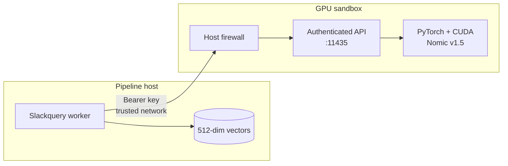

<div align="center">

# PyTorch Embedding Server

### A fast, authenticated GPU sidecar for Slackquery

`Ollama API subset` · `OpenAI API subset` · `CUDA` · `API-key protected`

**Sandbox software. Bind privately. Firewall the port. Do not expose it to the internet.**

</div>

---

The optional `slackquery-embedding` process serves
`nomic-ai/nomic-embed-text-v1.5` directly through PyTorch. Run it beside the
pipeline or on a GPU machine elsewhere on the trusted network. In one Pascal GPU
deployment it processed embeddings roughly **1.5× faster than Ollama**. That is
an observation, not a portable guarantee; benchmark your model, batch sizes, and
documents.

> [!CAUTION]
> This server has not received a security audit or production hardening review.
> Its bearer key limits accidental and unauthorized API use, but it does not
> provide TLS, tenant isolation, a WAF, request accounting, or protection against
> every denial-of-service technique. Keep it on an isolated host or VLAN, allow
> ingress only from Slackquery workers, and use a VPN or TLS reverse proxy if
> traffic leaves that boundary. Never publish port `11435` to the internet.

## The shape



| Route | Compatibility | Authentication | Purpose |
|---|---|---|---|
| `GET /health` | Slackquery | Bearer key | Device, model, and dimension check. |
| `GET /api/tags` | Ollama | Bearer key | Alias, revision, and model metadata. |
| `POST /api/embed` | Ollama | Bearer key | Native 768-dimensional embeddings. |
| `GET /v1/models` | OpenAI | Bearer key | Model discovery. |
| `POST /v1/embeddings` | OpenAI | Bearer key | OpenAI-shaped embedding response. |

The server returns raw 768-dimensional vectors. The Slackquery client takes the
first 512 Matryoshka dimensions and L2-normalizes them. Keeping that recipe in the
client guarantees the same storage contract for local and remote transports.

## 1. Prepare the GPU host

Use Python 3.11 or 3.12 and a working NVIDIA driver. Install the PyTorch wheel
that matches the GPU and driver before installing the optional server dependencies.
The standard installation is:

```bash
git clone https://github.com/thomasmaerz/slackquery.git
cd slackquery
python3 -m venv .venv
. .venv/bin/activate
python -m pip install --upgrade pip
python -m pip install -e '.[embedding-server]'
```

### Pascal GPUs such as Quadro P620

The tested Pascal path uses PyTorch 2.4.1 with CUDA 12.1 because that wheel still
contains `sm_61` kernels. Install it first, then install Slackquery without allowing
the resolver to replace it:

```bash
python -m pip install \
  torch==2.4.1 --index-url https://download.pytorch.org/whl/cu121
python -m pip install -e '.[embedding-server]'
python -c 'import torch; print(torch.__version__, torch.cuda.is_available(), torch.cuda.get_device_name(0))'
```

Expected output includes `2.4.1+cu121`, `True`, and the GPU name. Do not proceed
with a CUDA-required deployment if `torch.cuda.is_available()` is false.

> [!NOTE]
> Pascal has poor native FP16 throughput. The server intentionally uses FP32.
> Newer GPUs may need a different tested torch/CUDA combination.

## 2. Create the server secret

Generate a separate key for this API; do not reuse the MCP bearer token:

```bash
python -c 'import secrets; print(secrets.token_urlsafe(48))'
```

Create a root-readable environment file on the GPU host:

Resolve both repositories to immutable commits before starting. The model uses
reviewed remote code from a separate repository:

```bash
python -c 'from huggingface_hub import model_info; print(model_info("nomic-ai/nomic-embed-text-v1.5").sha); print(model_info("nomic-ai/nomic-bert-2048").sha)'
```

Inspect the selected model and code revisions before trusting them, then place
the two outputs in the environment file:

```dotenv
SLACKQUERY_EMBEDDING_SERVER_API_KEY=replace-with-generated-secret
SLACKQUERY_EMBEDDING_SERVER_HOST=127.0.0.1
SLACKQUERY_EMBEDDING_SERVER_PORT=11435
SLACKQUERY_EMBEDDING_SERVER_MODEL=nomic-ai/nomic-embed-text-v1.5
SLACKQUERY_EMBEDDING_SERVER_MODEL_ALIAS=nomic-embed-text:v1.5
SLACKQUERY_EMBEDDING_SERVER_MODEL_REVISION=40-character-model-commit
SLACKQUERY_EMBEDDING_SERVER_CODE_REVISION=40-character-code-commit
SLACKQUERY_EMBEDDING_SERVER_BATCH_SIZE=32
SLACKQUERY_EMBEDDING_SERVER_REQUIRE_CUDA=true
```

Use `127.0.0.1` when the worker runs on the same host. For a separate GPU host,
bind to its private interface or `0.0.0.0` only after installing a firewall rule
that permits port `11435/tcp` solely from the pipeline host.

## 3. Start it

Load the environment and run the dedicated process:

```bash
set -a
. /etc/slackquery/embedding.env
set +a
slackquery-embedding
```

The model downloads on first start. Subsequent starts use the Hugging Face cache.
Both revision values are passed to Hugging Face. Nomic requires remote model code
from `nomic-ai/nomic-bert-2048`, so changing either revision changes weights or
code trusted by the server account.
For a managed host, adapt
[`deploy/slackquery-embedding.service`](../deploy/slackquery-embedding.service),
then run:

```bash
sudo install -m 0644 deploy/slackquery-embedding.service \
  /etc/systemd/system/slackquery-embedding.service
sudo systemctl daemon-reload
sudo systemctl enable --now slackquery-embedding
sudo systemctl status slackquery-embedding
```

Keep the service environment file mode `0600`. Give the service account write
access to `/var/cache/slackquery-embedding` if that is the configured model cache.

## 4. Connect Slackquery

On the pipeline host, use the same key and the private URL:

```dotenv
EMBEDDING_BACKEND=pytorch
PYTORCH_EMBEDDING_BASE_URL=http://10.0.20.15:11435
EMBEDDING_API_KEY=replace-with-generated-secret
EMBEDDING_MODEL=nomic-embed-text:v1.5
SLACKQUERY_EMBEDDING_MODEL_REVISION=replace-with-verified-revision
SLACKQUERY_EMBEDDING_CODE_REVISION=replace-with-verified-code-revision
```

Restart the pipeline process after changing its environment, then verify the full
authenticated client contract:

```bash
slackquery embedding-status
```

The status output intentionally excludes the API key.

## 5. Probe the APIs

All routes require the key, including health checks:

```bash
export EMBEDDING_API_KEY='replace-with-generated-secret'

curl --fail --silent \
  -H "Authorization: Bearer $EMBEDDING_API_KEY" \
  http://127.0.0.1:11435/health

curl --fail --silent \
  -H "Authorization: Bearer $EMBEDDING_API_KEY" \
  -H 'Content-Type: application/json' \
  -d '{"model":"nomic-embed-text:v1.5","input":["search_query: database timeout"]}' \
  http://127.0.0.1:11435/api/embed
```

OpenAI-compatible clients use the same key and base URL:

```python
from openai import OpenAI

client = OpenAI(
    api_key="replace-with-generated-secret",
    base_url="http://127.0.0.1:11435/v1",
)
result = client.embeddings.create(
    model="nomic-embed-text:v1.5",
    input=["search_query: database timeout"],
)
print(len(result.data[0].embedding))  # 768
```

## Model identity and safe switching

The source model, model alias, revision, prefix recipe, output dimension, and
normalization must all remain stable for one embedding generation. PyTorch and
GGUF/Ollama can differ numerically even when they originate from the same model.
Before reusing an existing generation, compare retrieval quality and vector
similarity on a representative corpus. When in doubt, use a new revision and
re-embed rather than mixing vectors.

Pin both reviewed Hugging Face commits, keep them with the server configuration,
and set the same values in `SLACKQUERY_EMBEDDING_MODEL_REVISION` and
`SLACKQUERY_EMBEDDING_CODE_REVISION` on the client. The server requests those
exact revisions and reports both through `/api/tags`.

## Security boundary

API-key authentication is one layer, not the boundary itself:

1. Bind to loopback for same-host operation.
2. For remote operation, permit ingress only from known worker IPs.
3. Keep the API on a private VLAN, WireGuard network, or equivalent sandbox.
4. Put TLS in front of it before crossing an untrusted network; HTTP bearer keys
   are readable by anyone who can observe unencrypted traffic.
5. Rotate both server and client values together, and restart both processes.
6. Monitor process memory, GPU memory, request volume, and failed authentication.
7. Do not treat this scaffold as a public multi-tenant inference service.

## Troubleshooting

| Symptom | Check |
|---|---|
| `401 Unauthorized` | Client and server keys differ, or the bearer header is absent. |
| `CUDA is required` | Driver visibility, torch wheel, container device mapping, and `nvidia-smi`. |
| `model native dimension` | The configured source is not Nomic v1.5-compatible. |
| Digest mismatch | Client revision and server revision differ; do not bypass without review. |
| Slow first request | Model download, model load, and CUDA warm-up are still occurring. |
| Remote timeout | Bind address, host firewall, VLAN ACL, and route from the pipeline host. |
| Out of GPU memory | Reduce `SLACKQUERY_EMBEDDING_SERVER_BATCH_SIZE`; keep one worker process. |

Run exactly one Uvicorn worker per GPU. Multiple workers each load a model copy
and can exhaust VRAM.
